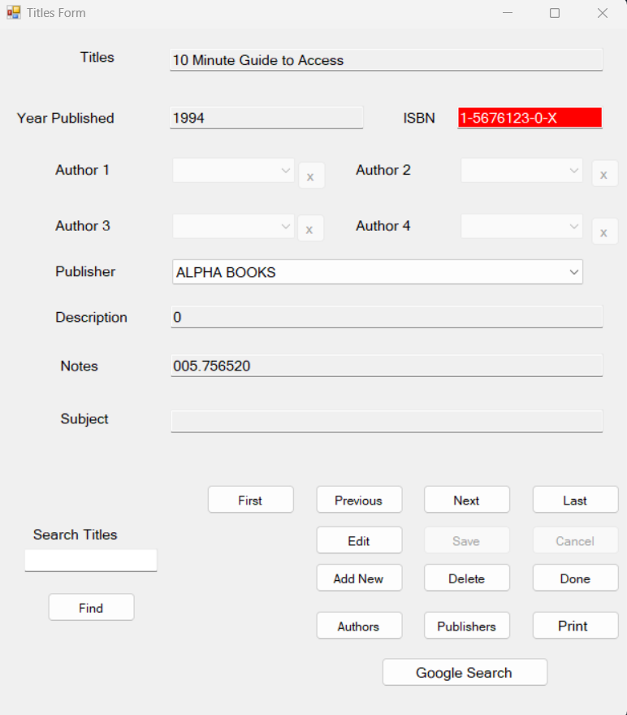
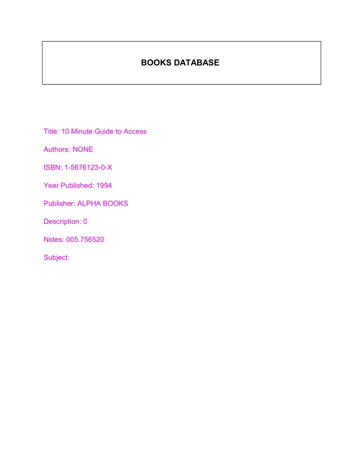
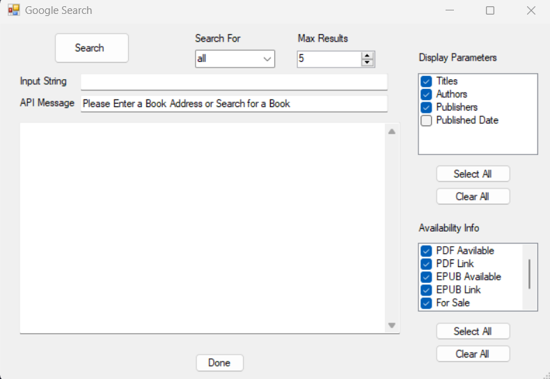

# MyBrary
# MyBrary
A C# .NET application allowing users to manage books related records stored in a database. Users can navigate through the stored records, search for a particular record, add a new record, and edit and delete records, and print a particular record. Finally, they can search the google books API for a keyword, author, title or a specific book ID and can select the fields displayed by the application.

#Main Form

#Printed Record

